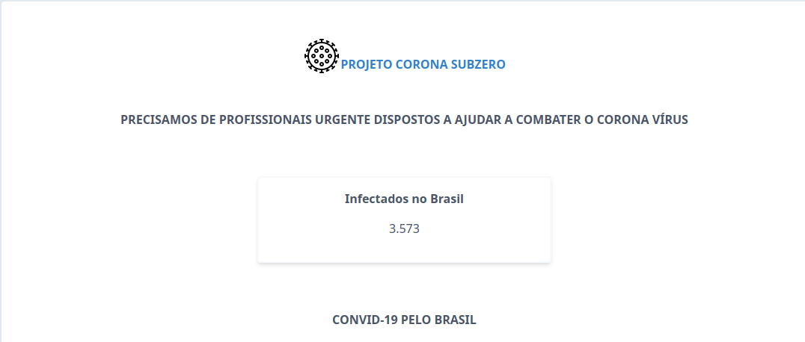
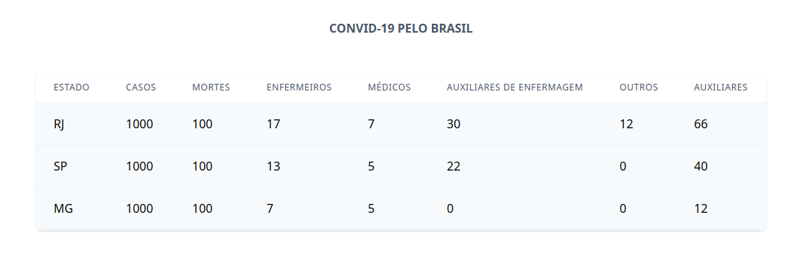
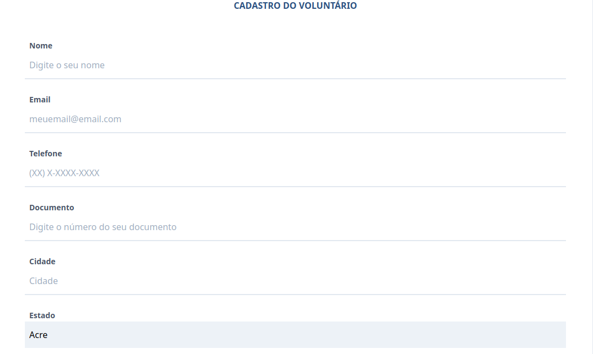
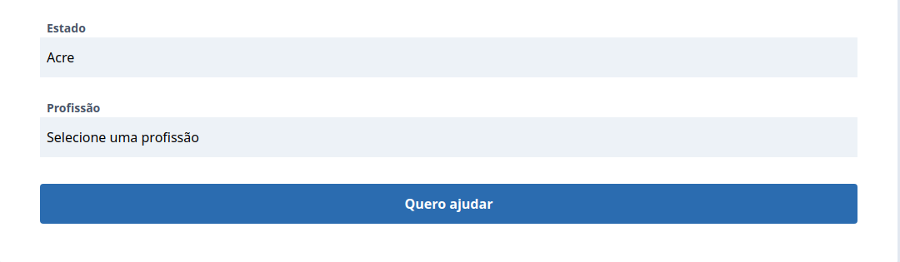
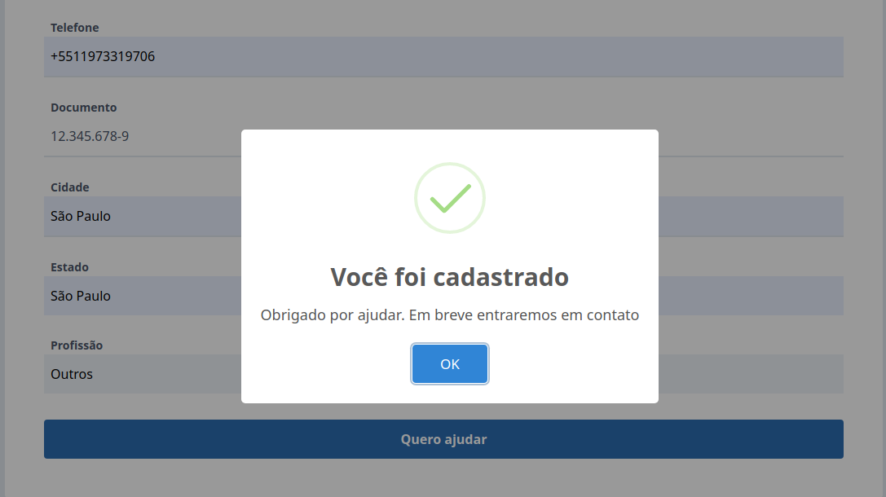
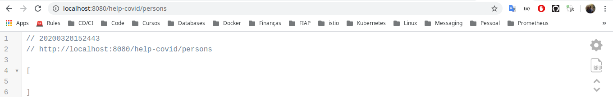

# **Fiap: Webservices & Restful Technologies**

## **Covd-19**

Esse projeto consiste em ajudar voluntários que desejem ajudar na causa do `COVID-19`, Conectando profissionais com `Hospistais`, ajudando no combate da desta `Pandemia`!

---

## **Repositórios:**

### **Repositórios utilizados neste projeto:**

[Frontend](https://github.com/flavio-silva/front-spa-webservices-fiap)

[APi](https://github.com/wellbastos/fiap-covid-webserver)

---

## **Informações Técnicas:**

Todos os dados inseridos no frontend são enviados para a Api via protocolo HTTP usandos seus verbos, Api faz a persistência destes dados num banco de dados Postgresql.

---

## **Deploy da Aplicação:**

### **Pré-requisitos:**

    Ter instalado estas ferramentas no computador:

    docker
    docker-compose
    java
    maven
    node
    npm

`executar no terminal:`

```sh
bash runall.sh
```

Aguarde o termino do script, e acesse eles:

[frontend](http://localhost:8081)

[Api](http://localhost:8080/help-covid/persons)

[Swagger](http://localhost:8080/swagger-ui.html)

---

## **Execução da Aplicação:**

**Frontend:**









**Frontend - Cadastro de Voluntário:**



**API:**



---

### **Grupo:**

Este Trabalho foi desenvolvido para à matéria de **Webservices & Restful Technologies** do **MBA - Fullstack developer, Microservices, Cloud e IOT**

`Pelos alunos:`

| Nome | RM|
|-------|:---:|
|**Flávio Alves Ferreira da Silva** |`RM: 333565`|
|**Milton Luiz Ribeiro Junior** |`RM: 333949`|
|**Pedro Madi Della Coletta** |`RM: 334109`|
|**Rafael Miranda de Almeida** |`RM: 333829`|
|**Rodrigo de Almeida Pereira** |`RM: 333241`|
|**Wellington Moreira Bastos** |`RM: 333878`|
|||

---
